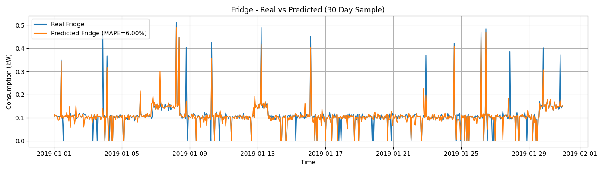
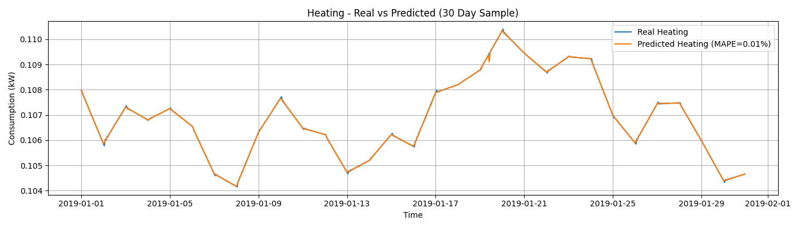
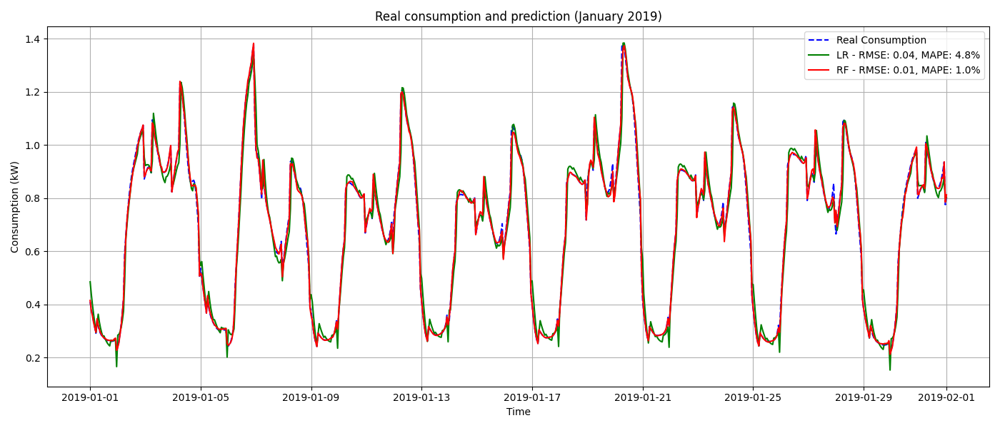
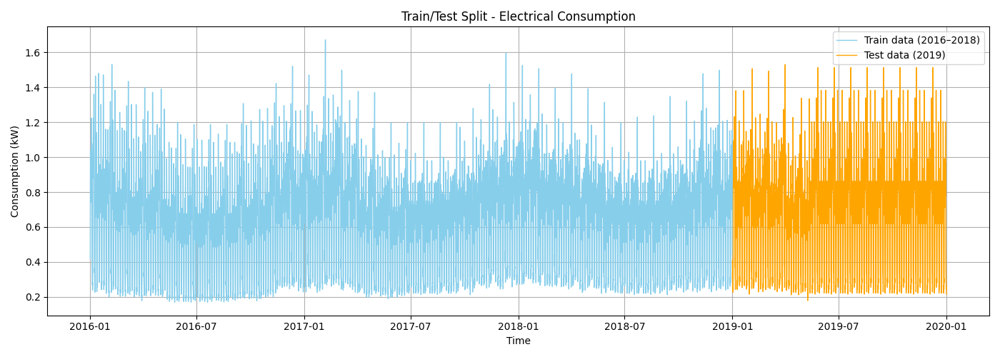

# NILM
# Energy Disaggregation Using Machine Learning and Thermal Modeling

This project presents a general methodology for non-intrusive load monitoring (NILM), allowing the disaggregation of total electricity consumption into individual appliance-level usage in buildings. 

The approach combines:
- A physics-based thermal model (1R1C and 2R2C) to simulate heating demand using PID control and weather data.
- The generation of synthetic appliance data (lighting, fridge, dishwasher, microwave, etc.).
- Supervised machine learning techniques (Random Forest and Linear Regression) to estimate appliance-level consumption.
- A full evaluation using error metrics (MAE, RMSE, MAPE, R²) for each appliance over a one-year dataset.

The methodology is scalable, interpretable, and applicable to various building types and energy systems.

## Key Features
- Heating simulation with physical thermal models.
- Synthetic dataset generation using Demandlib and real outdoor temperature data.
- Appliance disaggregation using Random Forest regressors.
- Comparison with Linear Regression baseline.
- Per-appliance error analysis and graphical outputs.

## Structure
- `thermal_model/` – PID-controlled heating model.
- `data_generation/` – Synthetic dataset and feature engineering.
- `models/` – Machine learning training and evaluation.
- `results/` – Figures and performance metrics.
- `notebooks/` – Jupyter notebooks for visualization and experimentation.

## Example Results






## Requirements
- Python ≥ 3.8
- scikit-learn, pandas, matplotlib, seaborn, numpy, demandlib, scipy

## Getting Started
```bash
git clone https://github.com/your-username/energy-disaggregation.git
cd energy-disaggregation
pip install -r requirements.txt
python main.py
